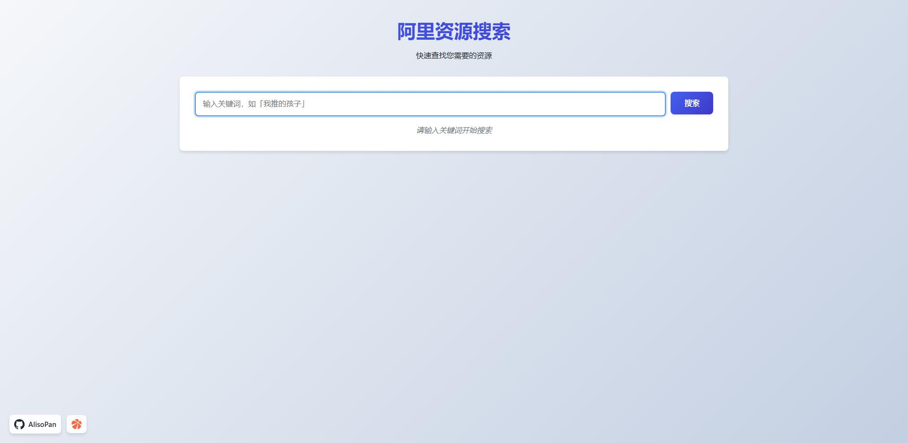
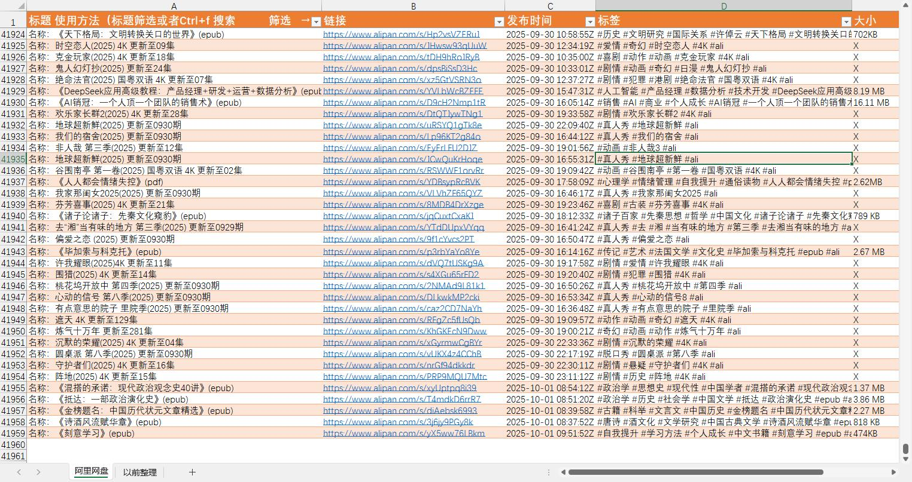

# 阿里资源搜索（AlisoPan）

一个基于纯 PHP 的本地资源搜索页面，从 `outputs.json` 中按关键词检索条目并展示，支持分页、时间倒序、基本安全防护与简洁现代化 UI。

> 我要不要提供数据呢！

## 图片





## 功能特性

- 关键词搜索（同时支持 POST 与 GET 方式）
- 结果按照时间 `sj` 字段倒序排序
- 分页展示（每页 20 条）
- URL 合法性校验（仅展示有效链接）
- 安全防护：
  - CSRF 令牌（POST 搜索时验证）
  - 输入过滤与输出转义（防 XSS）
  - 安全响应头（CSP、X-Frame-Options、X-Content-Type-Options 等）
- 响应式界面，简洁卡片式结果列表

## 目录结构

```
AlisoPan/
├── index.php      # 主入口（渲染页面、读取 JSON、搜索与分页逻辑）
└── outputs.json   # 数据文件
└── LICENSE.txt    # 许可证
└── README.md      # 项目说明
```

> 运行时需要在同目录放置 `outputs.json` 数据文件。

## 运行环境

- PHP 7.2+（建议 8.x）
- 可选：任何支持 PHP 的 Web 服务器（Apache/Nginx/PHP 内置服务器）

## 快速开始

1. 在根目录放置数据文件：
   - `outputs.json`（示例见下文）
2. 打开浏览器访问：
   - `http://localhost:8000/index.php`

## 数据文件：outputs.json

- 位置：与 `index.php` 同目录
- 类型：JSON 数组，每个元素为一个条目对象
- 字段约定：
  - `name`：资源名称（字符串）
  - `url`：资源链接（字符串，需为合法 URL）
  - `sj`：时间（字符串，能被 `strtotime` 正确解析，如 `2025-09-30 22:15`）

示例：

```json
[
  {
    "name": "我推的孩子 第1季",
    "url": "https://example.com/resource/xxx",
    "sj": "2025-09-30 22:15"
  },
  {
    "name": "示例资源B",
    "url": "https://example.com/b",
    "sj": "2025-08-10 09:00"
  }
]
```

> 程序会自动忽略 JSON 解析错误并记录到 `error_log`（若启用），无 `sj` 或不可解析时间则视为最旧。

## 使用方法

- 页面搜索框直接输入关键词后提交
- 支持通过 URL 传参：
  - `q`: 关键词（例如 `?q=我推的孩子`）
  - `page`: 页码（从 1 开始，例如 `?q=我推的孩子&page=2`）
- 搜索结果会分页显示，并提供上一页/下一页按钮

## 安全说明

- 已设置多项安全响应头（CSP、X-Frame-Options、X-XSS-Protection、X-Content-Type-Options、Referrer-Policy）
- 所有输入都会进行 `strip_tags` 和 `htmlspecialchars` 过滤与转义
- POST 搜索需要有效 CSRF 令牌（表单中已自动注入）
- 外链打开使用 `target="_blank"` 且 `rel="noopener noreferrer"`

## 开发与定制

- 每页数量：在 `index.php` 顶部靠后位置的 `$perPage = 20;` 可修改
- 排序：默认按 `sj` 时间倒序，可在 `usort` 回调中调整
- 样式：直接修改 `index.php` 中内联 CSS
- 数据源：逻辑读取本地 `outputs.json`，如需改为数据库或 API，请替换读取与解析部分

## 常见问题

- 页面空白或无结果：
  - 确认 `outputs.json` 存在且为合法 JSON
  - 关键词是否输入正确
- 链接显示“无效URL”：
  - 检查 `url` 字段是否为完整的 `http/https` 链接
- 时间未显示：
  - `sj` 需为可被 `strtotime` 解析的格式

## 许可证

MIT